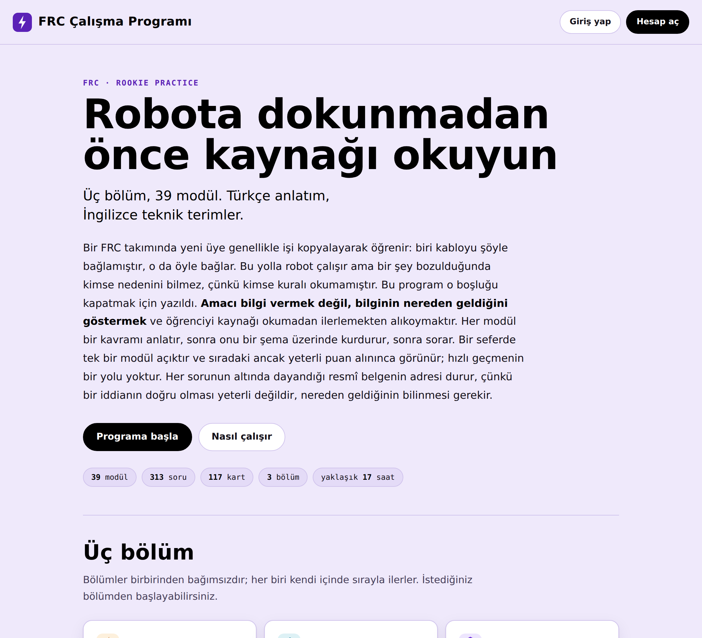
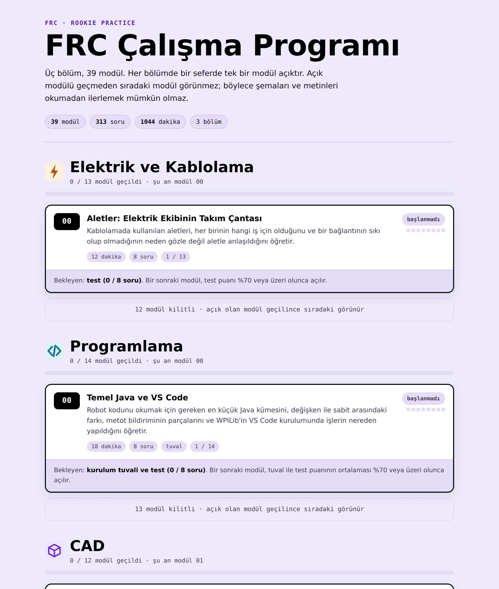
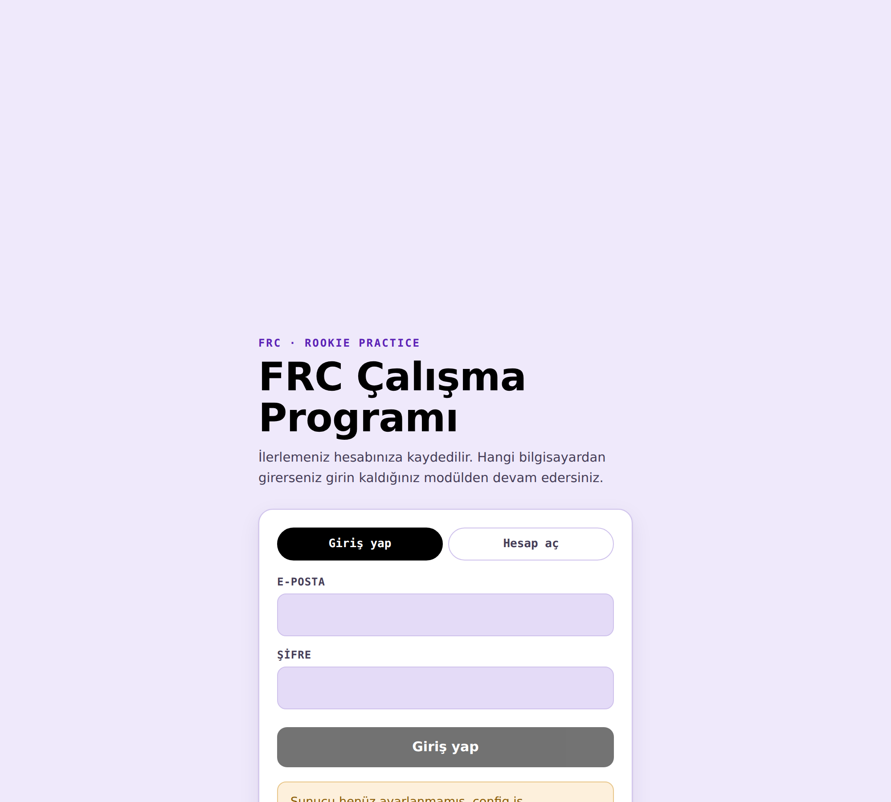
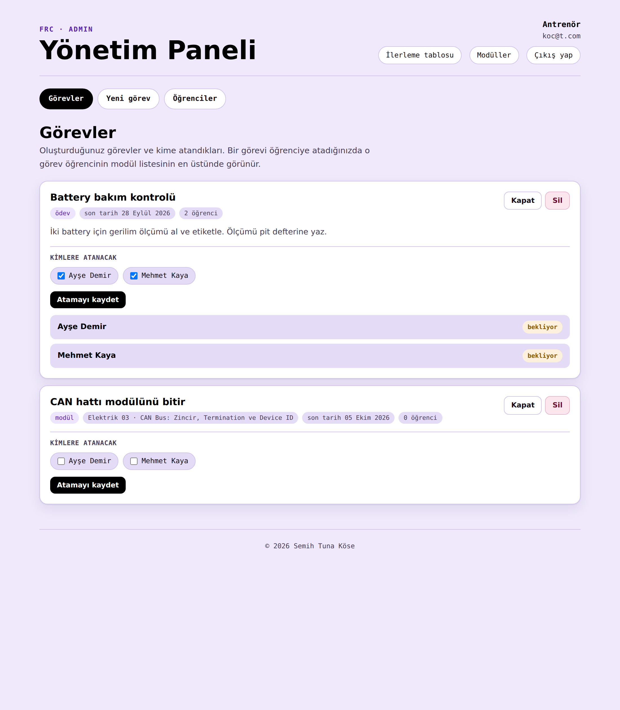
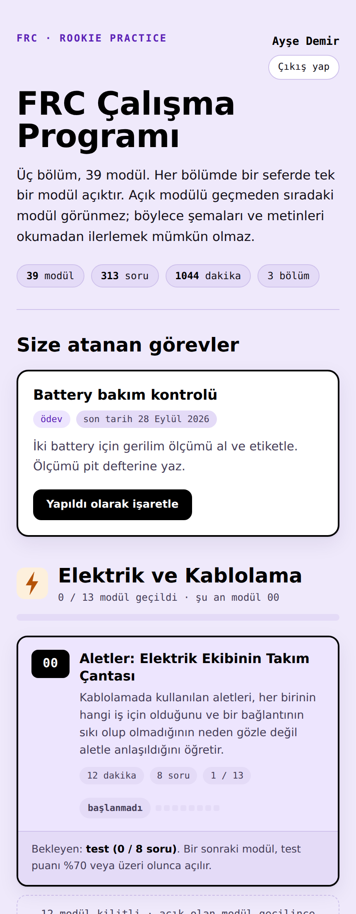

# FRC Çalışma Programı

FRC'ye yeni katılan lise öğrencileri için Türkçe bir çalışma programı.
Üç bölüm, 39 modül: **Elektrik ve Kablolama**, **Programlama** (WPILib / Java),
**CAD** (Onshape).

Her modülde bir kavram anlatımı, üç kart, bir örnek şema, bir kurulum tuvali ve
bir test vardır. Bir seferde tek bir modül açıktır; sıradaki modül ancak tuval ile
test puanının ortalaması %70'e ulaşınca görünür. Amaç, şemaları ve metinleri
okumadan ilerlemeyi mümkün kılmamaktır.





---

## Hızlı başlangıç

Depoyu indirin ve `index.html` dosyasını tarayıcıda açın; karşılama sayfası açılır,
oradan programa geçilir. Kurulum gerekmez,
sunucu gerekmez, internet gerekmez. İlerleme tarayıcıya kaydedilir.

```
git clone https://github.com/<kullanici>/frc-calisma-programi.git
cd frc-calisma-programi
# index.html dosyasını çift tıklayın
```

Bütün dosyalar aynı klasörde durmalıdır; ana ekran modül sayfalarına aynı
klasördeki adlarıyla bağlanır.

## Yayına almak

Klasör olduğu gibi statik bir barındırma hizmetine yüklenebilir. GitHub Pages için:
**Settings → Pages → Source: Deploy from a branch → main / (root)**. Birkaç dakika
içinde site adresiniz hazır olur ve program telefondan da açılır.

Depo herkese açıksa modül içeriği adresi bilen herkese açılır. Programın amacı
içeriği gizlemek değil, öğrencinin sırayı atlamasını engellemektir; o kilit
sunucuda tutulur.

## Hesap sistemi (isteğe bağlı)

`config.js` boş bırakıldığı sürece program girişsiz çalışır ve ilerlemeyi yalnızca
o tarayıcıya kaydeder. Hesap sistemini açtığınızda ilerleme sunucuda tutulur:

- Öğrenci hangi bilgisayardan girerse girsin kaldığı modülden devam eder
- Puanlar **bir kez yazılır ve değiştirilemez**; bu kural veritabanında uygulanır,
  sayfada değil, dolayısıyla tarayıcı araçlarıyla aşılamaz
- Antrenör, `koc.html` sayfasından bütün öğrencilerin modül modül puanlarını görür
- `admin.html` yönetim panelinden görev oluşturup öğrencilere atayabilir; atanan
  görev öğrencinin modül listesinin en üstünde görünür
- İsterseniz Google ile giriş açılabilir; öğrenci şifre hatırlamak zorunda kalmaz

Kurulum on beş dakika sürer ve ücretsizdir: [docs/KURULUM.md](docs/KURULUM.md)

Site herkese açık bir adreste yayındaysa, Supabase'de **yeni kayıtları kapatıp**
hesapları kendiniz açmanız önerilir. Aksi hâlde adresi bulan herkes hesap
açabilir ve takım listeniz yabancı kayıtlarla dolar. Ayrıntı `docs/KURULUM.md`
içinde.



### Görev atama

Ders içeriği hazır olmasa da altyapı kurulu: antrenör ödev, okuma, modül
çalışması veya serbest çalışma türünde görev oluşturur, son tarih verir,
öğrencileri seçer. Öğrenci görevi kendi sayfasında görür ve yaptığını
işaretler; antrenör teslimi puanlar. Bir öğrenci yalnızca kendisine atanmış
görevleri görebilir — bunu veritabanı kuralları uygular, sayfa değil.





---

## Depo yapısı

```
index.html                     karşılama sayfası, misyon ve giriş seçenekleri
moduller.html                  modül listesi, sıralı kilit
giris.html                     kayıt ve giriş
koc.html                       antrenör ilerleme tablosu
admin.html                     yönetim paneli: görev oluşturma ve atama
config.js                      Supabase bağlantı ayarları (boş gelir)
sync.js                        oturum ve ilerleme katmanı
schema.sql                     veritabanı şeması ve güvenlik kuralları

electrical-00 … electrical-12  13 modül sayfası
programming-00 … programming-12 14 modül sayfası
cad-01 … cad-12                12 modül sayfası

modules/electrical/*.json      modül kaynakları: kavram, kartlar, sorular
modules/programming/*.json
modules/cad/*.json

docs/KURULUM.md                hesap sistemi kurulumu
docs/YAPI.md                   sayfaların nasıl değiştirileceği
docs/BILINEN-SORUNLAR.md       bilinen içerik sorunları
404.html                       bulunamayan adresler için
tools/kontrol.mjs              depo bütünlük kontrolü
.github/workflows/kontrol.yml  her push'ta kontrolü çalıştırır
CONTRIBUTING.md                hata bildirimi
SECURITY.md                    depodaki anahtar ve zafiyet bildirimi
LICENSE                        kullanım koşulları
```

Depoyu klonladıktan sonra bütünlüğü kendiniz de denetleyebilirsiniz:

```
node tools/kontrol.mjs
```

Bağımlılık gerektirmez. Kaynak adresi olmayan soru, eksik kart, kırık önkoşul,
iki modülde aynı kayıt anahtarı, eksik telif satırı, karşılama sayfasının yanlış
sayı duyurması ve `config.js` içine kaçmış gizli bir anahtar gibi durumları
arar. Aynı denetim her push'ta GitHub Actions üzerinde de çalışır.

`index.html` karşılama sayfasıdır ve giriş istemez; programın kendisi
`moduller.html` adresindedir. Her modül sayfası kendi kendine yeten tek bir HTML
dosyasıdır: şemalar satır içi
SVG, tuval ve test saf JavaScript. Dış kütüphane yoktur; yalnızca yazı tipleri
Google Fonts'tan gelir. `modules/` altındaki JSON dosyaları o sayfaların üretildiği
kaynaklardır ve sayfa çalışırken okunmaz.

## Modül kaynaklarının biçimi

```jsonc
{
  "id": "cad-02-sketching",
  "department": "cad",
  "moduleNumber": 2,
  "schemaVersion": 2,
  "season": "2026",
  "title": "Sketch Temelleri ve Kısıtlanma Durumu",
  "summary": "...",
  "prerequisites": ["cad-01-onshape-basics"],
  "estimatedMinutes": 30,
  "concept": { "body": "...", "keyTerms": [ ... ] },
  "cards":  [ /* 3 kart: behaviour → mechanism → pit */ ],
  "drills": [ /* 8 soru; her birinde source URL'si ve açıklama */ ]
}
```

Kartlar bir merdivendir: **behaviour** öğrencinin gördüğü davranışı, **mechanism**
altındaki mekanizmayı, **pit** sahada bu bilgiyi bilmemenin bedelini anlatır.
Her kartın `derivedFrom` alanı dayandığı iki soruyu gösterir.

## İçeriğin kuralları

Bu programın yazımında bir kural bağlayıcı oldu: **hafızadan yazılmadı.** Her
soru, açıklaması ve kavram metni birincil bir kaynağa bağlıdır ve her sorunun
`source` alanında o kaynağın adresi durur. Kaynaklar FIRST oyun el kitabı ve
denetim listeleri, WPILib belgeleri, Onshape Learning Center ve Oracle Java
belgeleridir. Doğrulanamayan bir olgu yazılmadı; eksik kalanlar not edildi.

Metinler özgün Türkçe anlatımdır, çeviri değildir. Teknik terimler İngilizce
bırakılmıştır (sketch, mate, breaker, subsystem); uydurma Türkçe karşılık
üretilmemiştir. Sayılar, birimler ve parça adları kaynaktaki yazımıyla kullanılır
(12V, 120A, 6 AWG, roboRIO, SPARK MAX).

Bilinen içerik sorunları sessizce düzeltilmedi, kayda geçirildi:
[docs/BILINEN-SORUNLAR.md](docs/BILINEN-SORUNLAR.md)

Bir olgu hatası bulduysanız bildirin; nasıl bildirileceği
[CONTRIBUTING.md](CONTRIBUTING.md) içinde yazıyor. Kaynak adresi olmadan
düzeltme yapılmıyor.

## Telif ve kaynaklar

© 2026 Semih Tuna Köse.

Tüm hakları saklıdır. Kullanım koşulları [LICENSE](LICENSE) dosyasındadır:
depoyu görüntülemek ve kendi öğreniminiz için okumak serbesttir, bunun ötesindeki
kopyalama, dağıtma, değiştirme ve kullanım izne bağlıdır.

Alıntılanan kural metinleri, belgeler ve terimler sahiplerine aittir. FIRST®,
FRC® ve ilgili markalar *For Inspiration and Recognition of Science and
Technology*'ye aittir. Bu proje bağımsız bir çalışmadır; FIRST tarafından
desteklenmemekte veya onaylanmamaktadır. Kural metinleri özet ve öğretim amacıyla
kullanılmıştır; yarışmada geçerli olan tek metin yürürlükteki resmî oyun el
kitabıdır.

---

## In English

A Turkish-language practice curriculum for FRC rookies, covering three
departments in 39 modules: **electrical and wiring**, **programming**
(WPILib / Java) and **CAD** (Onshape).

Each module carries a concept explanation, three cards, a worked diagram, a
build canvas and a test. Only one module is unlocked at a time; the next one
appears once the average of the canvas score and the test score reaches 70%.
The point is to make it impossible to advance without reading the diagrams and
the text.

Every module page is a single self-contained HTML file with no external
dependencies — inline SVG diagrams, plain JavaScript, no build step. Open
`index.html` for the landing page and `moduller.html` for the programme itself. The JSON files under `modules/` are the sources those
pages were generated from.

An optional account system stores progress server-side (Supabase), so a student
resumes on any machine and scores become write-once at the database level rather
than trusting the browser. Setup instructions are in `docs/KURULUM.md` (Turkish).

The content is written in Turkish and grounded in primary sources — the FIRST
game manual and inspection checklists, WPILib documentation, the Onshape Learning
Center and the Oracle Java tutorials. Every question carries the URL of the source
it rests on. Nothing was written from memory.

© 2026 Semih Tuna Köse. All rights reserved — see [LICENSE](LICENSE). Viewing
the repository and reading it for your own learning is permitted; copying,
redistributing, modifying or otherwise using it requires permission. FIRST® and
FRC® are trademarks of For Inspiration and Recognition of Science and Technology.
This project is independent and is not endorsed by or affiliated with FIRST. The
official game manual is the only authority on the rules.
